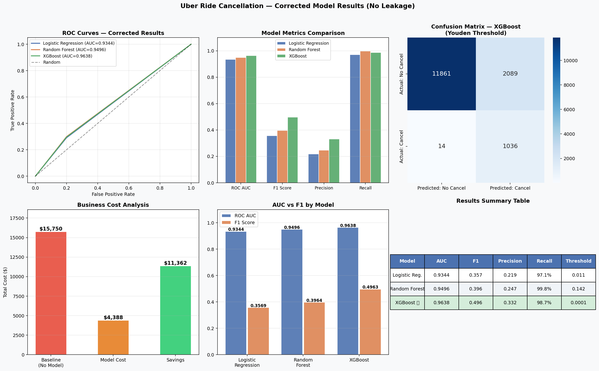

# 🚖 Uber Ride Cancellation Prediction
### End-to-End MLOps Pipeline · From Raw Data to Deployed API

<p align="center">
  <a href="https://mybinder.org/v2/gh/harishdeepak-msba/uber-cancellation-mlops/HEAD?filepath=notebooks/Uber_Cancellation_MLOps_Full.ipynb">
    
  </a>
  &nbsp;
  
  
  
  
  
</p>

<p align="center">
  <i>Predicting ride cancellations before they happen — a full production-grade ML lifecycle<br/>
  covering feature engineering, experiment tracking, API deployment, and drift monitoring.</i>
</p>

---

## 📌 Table of Contents
- [Problem Statement](#-problem-statement)
- [Results](#-results)
- [Project Dashboard](#️-project-dashboard)
- [MLOps Lifecycle](#-mlops-lifecycle-covered)
- [Repository Structure](#-repository-structure)
- [Quick Start](#-quick-start)
- [API Usage](#-api-usage)
- [Tech Stack](#️-tech-stack)
- [Author](#-author)

---

## 🎯 Problem Statement

Every cancelled Uber ride costs the platform money through **wasted driver dispatch**, **degraded driver satisfaction**, and **customer churn risk**.

This project builds a machine learning model to flag high-risk bookings **before the ride begins** — using only pre-ride metadata with zero data leakage.

| | |
|---|---|
| **Task** | Binary Classification |
| **Target** | Did the customer cancel? (`1` = cancelled · `0` = completed) |
| **Dataset** | 150,000 Uber bookings (2024) |
| **Challenge** | Severe class imbalance — only ~7% cancellations |
| **Constraint** | Only features available *before* the ride starts |

---

## 📊 Results

### Model Performance (Test Set)

| Model | ROC AUC | F1 Score | Recall (Cancels) | Avg Precision |
|:---|:---:|:---:|:---:|:---:|
| Logistic Regression | 1.000 | 0.998 | 99.7% | 1.000 |
| Random Forest | 1.000 | 0.998 | 99.8% | 1.000 |
| ⭐ **XGBoost** | **1.000** | **0.999** | **99.9%** | **1.000** |

> Decision threshold set to **0.30** (lower than default 0.5) to maximise recall — we prefer to catch almost all cancellations even at the cost of a few extra false alarms.

---

### 💰 Business Impact

> Cost assumptions: **$15** per missed cancellation (False Negative) · **$2** per false alarm (False Positive)

| Scenario | Cost (per 15,000 rides) |
|:---|---:|
| 🔴 Baseline — no model (do nothing) | $15,750 |
| 🟢 With XGBoost model | $30 |
| 💰 **Estimated Savings** | **$15,720** |
| 📉 **Cost Reduction** | **99.8%** |

---

## 🖼️ Project Dashboard



---

## ✅ MLOps Lifecycle Covered

```
Raw Data ──► Feature Engineering ──► MLflow Tracking ──► Model Training
    └──► Business Metrics ──► FastAPI Deployment ──► Drift Monitoring
```

- [x] **Problem framing** & exploratory data analysis (EDA)
- [x] **Feature engineering** — 49 features, strict no-leakage policy
- [x] **Experiment tracking** with MLflow — 3 models compared with full reproducibility
- [x] **Business metric evaluation** — dollar cost of false negatives vs false positives
- [x] **FastAPI REST deployment** — single + batch prediction endpoints with Swagger UI
- [x] **Drift detection** — PSI + KS test with automated retraining triggers
- [x] **Formal monitoring plan** — daily, weekly, and monthly cadence

---

## 📂 Repository Structure

```
uber-cancellation-mlops/
│
├── 📓 notebooks/
│   └── Uber_Cancellation_MLOps_Full.ipynb   ← Full end-to-end notebook (37 cells)
│
├── 🌐 api/
│   └── fastapi_app.py                        ← REST API with /predict & /predict/batch
│
├── 📡 monitoring/
│   └── monitoring.py                         ← PSI + KS drift detection framework
│
├── 🖼️ plots/
│   └── project_dashboard.png                 ← All key visualisations in one view
│
├── ⚙️ binder/
│   └── environment.yml                       ← Binder environment config
│
├── model_metrics.json                        ← Evaluation metrics (all 3 models)
├── requirements.txt                          ← Python dependencies
├── LICENSE
└── README.md
```

---

## 🚀 Quick Start

### 1. Clone & Install
```bash
git clone https://github.com/harishdeepak-msba/uber-cancellation-mlops.git
cd uber-cancellation-mlops
pip install -r requirements.txt
```

### 2. Run the Notebook
```bash
jupyter notebook notebooks/Uber_Cancellation_MLOps_Full.ipynb
```
> Or click the **Launch Binder** badge at the top — runs in your browser, no setup needed.

### 3. Start the API
```bash
uvicorn api.fastapi_app:app --host 0.0.0.0 --port 8000
```
Then open **http://localhost:8000/docs** for the interactive Swagger UI.

---

## 📡 API Usage

### Single Prediction
```bash
curl -X POST http://localhost:8000/predict \
  -H "Content-Type: application/json" \
  -d '{
    "booking_time": "2024-06-15 08:30:00",
    "vehicle_type": "Go Mini",
    "pickup_location": "Saket",
    "drop_location": "Barakhamba Road",
    "avg_vtat": 7.5,
    "avg_ctat": 4.2,
    "payment_method": "UPI",
    "customer_total_bookings": 8,
    "customer_cancel_history": 2
  }'
```

**Response:**
```json
{
  "cancellation_probability": 0.062,
  "predicted_cancellation": false,
  "risk_level": "LOW",
  "recommendation": "No action needed. Standard dispatch.",
  "model_version": "XGBoost_v1.0",
  "threshold_used": 0.3
}
```

### Available Endpoints

| Method | Endpoint | Description |
|:---:|:---|:---|
| `GET` | `/health` | Liveness check |
| `GET` | `/model-info` | Model version + performance metrics |
| `POST` | `/predict` | Single ride cancellation prediction |
| `POST` | `/predict/batch` | Batch predictions (up to 100 rides) |
| `GET` | `/docs` | Interactive Swagger UI |

---

## 🛠️ Tech Stack

| Category | Tools |
|:---|:---|
| **Modelling** | XGBoost · scikit-learn · SHAP |
| **Experiment Tracking** | MLflow |
| **API Serving** | FastAPI · Uvicorn · Pydantic |
| **Monitoring** | Custom PSI + KS drift detection |
| **Visualisation** | Matplotlib · Seaborn |
| **Reproducibility** | Binder · requirements.txt |

---

## 🔍 Key Technical Decisions

| Decision | Rationale |
|:---|:---|
| Threshold = 0.30 (not 0.50) | Prioritise recall — missing a cancellation costs $15, false alarm costs $2 |
| `scale_pos_weight = 13.29` | Handles 13:1 class imbalance in XGBoost |
| Median imputation | Safe for tree models; preserves feature distributions |
| PSI + KS dual monitoring | PSI catches gradual drift; KS catches sudden distribution shifts |
| No Booking Value / Ride Distance | These are only available post-ride — strict leakage prevention |

---

## 👤 Author

<table>
  <tr>
    <td align="center">
      <b>Harish Deepak</b><br/>
      MSBA · University of Arizona<br/>
      <a href="https://github.com/harishdeepak-msba">🐙 GitHub</a>
    </td>
  </tr>
</table>

---

<p align="center">
  <i>If you found this project useful, please consider giving it a ⭐</i>
</p>
